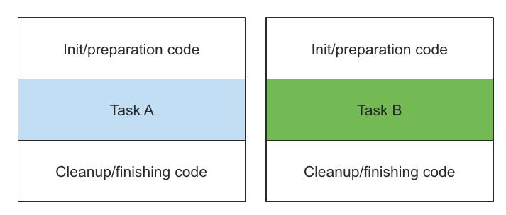
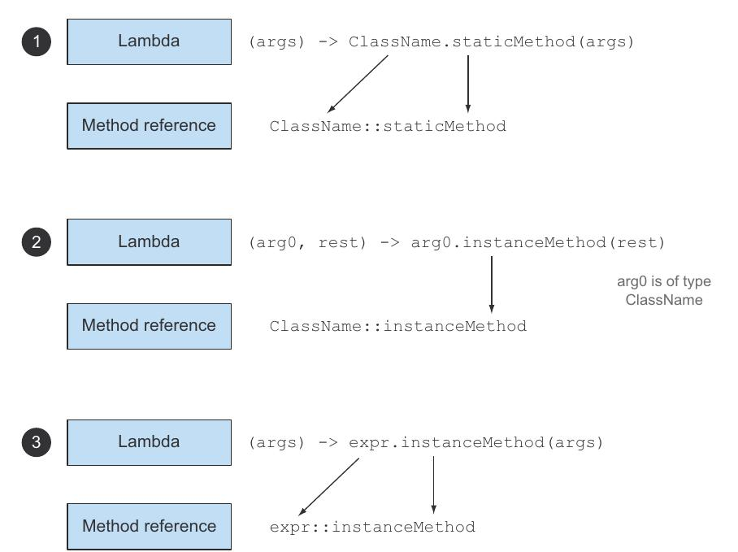

[[Lambda]]
== Lambda Expressions

=== Lambdas in a nutshell

A lambda expression can be understood as a concise representation of an anonymous function that can be passed around,
it doesn’t have a name, but :

* it has a list of parameters,
* a body,
* a return type,
* and also possibly a list of exceptions that can be thrown.

It is:

* _Anonymous_, because it doesn’t have an explicit name like a method would normally have: less to write and think about!
* _Function_, because a lambda *isn’t associated with a particular class* like a method is. But like a method,
a lambda has a list of parameters, a body, a return type, and a possible list of exceptions that can be thrown.
* _Passed around_, A lambda expression can be passed as argument to a method or stored in a variable.
* _Concise_, You don’t need to write a lot of boilerplate like you do for anonymous classes.

NOTE: Lambdas technically don’t let you do anything that you couldn’t do prior to Java 8. But you no longer have to write
clumsy code using anonymous classes to benefit from behavior parameterization! Lambda expressions will encourage
to adopt the style of behavior parameterization.

The lambda has three parts:

* _A list of parameters_ .
* _An arrow_, *->* separates the list of parameters from the body of the lambda.
* _The body_ of the lambda.

[source,java]
----
(String s) -> s.length() <1>
----
<1> The lambda expression has one parameter of type String and returns an int. The lambda doesn’t have a return
statement here because the return is implied.

[source,java]
----
(Apple a) -> a.getWeight() > 150 <1>
----
<1> The lambda expression has one parameter of type Apple and returns a boolean

[source,java]
----
(int x, int y) -> {
    System.out.println( "Result:" );
    System.out.println( x+y );
} <1>
----
<1> The lambda expression has two parameters of type int with no return (void return). Note that lambda expressions
can contain multiple statements.

[source,java]
----
() -> 42 <1>
----
<1> The lambda expression has no parameter and returns an int.

[source,java]
----
(Apple a1, Apple a2) -> a1.getWeight().compareTo( a2.getWeight() ) <1>
----
<1> The lambda expression has two parameters of type Apple and returns an int.

IMPORTANT: The basic syntax of a lambda is either +
*(parameters) -> expression* +
or (note the curly braces for statements) +
*(parameters) -> { statements; }* +

[source,java]
----
() -> {} <1>
----
<1>  This lambda has no parameters and returns void. It’s similar to a method with an empty body: public void run() { }.

[source,java]
----
() -> "Raoul" <1>
----
<1> This lambda has no parameters and returns a String as an expression.

[source,java]
----
() -> {return "Mario";} <1>
----
<1> This lambda has no parameters and returns a String (using an explicit return statement).

The next two are *not valid* lambda expressions

[source,java]
----
(Integer id) -> return "Alan" + id; <1>
----
<1> return is a control-flow statement. A lambda valid, requires curly braces as: `(Integer id) -> {return "Alan" + id;}`

[source,java]
----
(String s) -> {"Iron Man";} <1>
----
<1> “Iron Man” is an expression, not a statement. To make this lambda valid, you can remove the curly braces
and semicolon as follows: `(String s) -> "Iron Man"`. Or if you prefer, you can use an explicit return statement as follows:
`(String s) -> {return "Iron Man";}`.

=== Where and how to use lambdas: The Functional Interface

In a nutshell, a *functional interface* is _an interface that specifies exactly one abstract method_.

[source,java]
----
Comparator<Apple> byWeight =
(Apple a1, Apple a2) -> a1.getWeight().compareTo( a2.getWeight() ); <1>

List<Apple> greenApples =
filter( inventory, (Apple a) -> "green".equals( a.getColor() ) ); <2>
----

<1> you assigned a lambda to a variable of type `Comparator<T>`
<2> you can pass a lambda as second argument to the method filter because it expects a `Predicate<T>`, which
is a *functional interface*.

IMPORTANT: You can use a lambda expression in the context of a *functional interface*.

.Functional Interfaces

[source,java]
----
public interface Predicate<T>{
    boolean test (T t);
}

public interface Comparator<T> {
    int compare(T o1, T o2);
}

public interface Runnable{
    void run();
}
----

NOTE:  An interface is still a functional interface if it has many default methods as long as it specifies only one
abstract method.

IMPORTANT: Lambda expressions let you provide the implementation of the abstract method of a functional interface directly inline
and _treat the whole expression as an instance of a functional interface_ (more technically speaking, an instance of a
concrete implementation of the functional interface).

.Function description

The signature of the abstract method of the functional interface essentially describes the signature of the lambda
expression. *We call this abstract method a "__function descriptor__".*

For example, the Runnable interface can be viewed as the signature of a function that accepts nothing and returns
nothing (void) because it has only one abstract method called run, which accepts nothing and returns nothing (void).

`() -> void` represents a function with an empty list of parameters returning void. This is exactly what
the Runnable interface represents.

`(Apple, Apple) -> int` denotes a function taking two Apples as parameters and returning an int.

IMPORTANT: A lambda expression can be assigned to a variable or passed to a method expecting a functional interface as
argument, provided _the lambda expression has the same signature as the abstract method of the functional interface_.

[source,java]
----
public interface Runnable{
    void run();
}
----

[source,java]
----
public void process(Runnable r){
    r.run();
}

process( () -> System.out.println( "This is awesome!!" ) );
----
The lambda expression `() -> System.out.println("This is awesome!!")` takes no parameters and returns void.
This is exactly the signature of the run method defined in the Runnable interface.

[source,java]
----
execute( () -> {} ); <1>

public void execute(Runnable r){
    r.run();
}
----
<1> It's valid

[source,java]
----
public Callable<String> fetch() {
    return () -> "Tricky example ;-)"; <1>
}
----
<1>  valid, Callable<String> essentially defines a method with the signature `() -> String` when T is replaced with
String. Because the lambda `() -> "Tricky example ;-)"` has the signature `() -> String`, the lambda can be used in
this context.

[source,java]
----
 Predicate<Apple> p = (Apple a) -> a.getWeight(); <1>
----
<1> Not valid, because the lambda expression `(Apple a) -> a.getWeight()` has the signature `(Apple) -> Integer`,
which is different than the signature of the method test defined in Predicate<Apple> that is `(Apple) -> boolean`.

.@FunctionalInterface
The compiler will return a meaningful error if you define an interface using the *@FunctionalInterface* annotation and
it isn’t a functional interface.

NOTE: The @FunctionalInterface annotation is NOT mandatory, but it’s good practice to use it when an interface is
designed for that purpose.

NOTE: Lambda expressions let you provide the implementation of the abstract method of a functional interface directly
inline, and they treat the whole expression as an instance of a functional interface.

=== Putting lambdas into practice: the Execute Around pattern

A recurrent pattern in resource processing (for example, dealing with files or databases) is to open a resource,
do some processing on it, and then close the resource. The setup and cleanup phases are always similar and surround the
important code doing the processing. This is called the *execute around pattern*.

[source,java]
----
public static String processFile() throws IOException {
    try ( BufferedReader br = new BufferedReader( new FileReader("data.txt") ) ) {
        return br.readLine(); <1>
    }
}
----
<1> is the only line that does useful work

_Ideally, you’d like to reuse the code doing setup and cleanup and tell the processFile method to perform different
actions on the file._

You need to *parameterize the behavior* of processFile. You need a way to pass behavior to processFile so it can execute
different behaviors using a BufferedReader.

*Passing behavior is exactly what lambdas are for*

You basically need a lambda that takes a BufferedReader and returns a String.

[source,java]
----
String result = processFile( (BufferedReader br) -> br.readLine() + br.readLine() );
----

.1 Create the Functional Interface
That lambdas can be used only in the context of a functional interface. so, you need to create one that matches
the signature `BufferedReader -> String` and that may throw an IOException

[source,java]
----
@FunctionalInterface
public interface BufferedReaderProcessor {
    String process(BufferedReader b) throws IOException;
}
----

.2 Use the Functional Interface to pass behavior
You can now use this interface as the argument to your new processFile method:
[source,java]
----
public static String processFile(BufferedReaderProcessor p) throws IOException {
    ...
}
----

.3 Execute behavior
Any lambdas of the form `BufferedReader -> String` can be passed as arguments, because they match the signature of
the process method defined in the BufferedReaderProcessor interface.

[source,java]
----
public static String processFile(BufferedReaderProcessor p) throws IOException {
    try ( BufferedReader br = new BufferedReader( new FileReader("data.txt") ) ) {
        return p.process( br ); <1>
    }
}
----
<1> Process the BufferReader object

.4 Pass lambdas
You can now reuse the processFile method and process files in different ways by passing different lambdas. +
Processing one line: +
`String oneLine = processFile( (BufferedReader br) -> br.readLine() );` +
Processing two lines: +
 `String twoLines = processFile( (BufferedReader br) -> br.readLine() + br.readLine() );`

=== Using functional interfaces

The signature of the abstract method of a functional interface is called a *function descriptor*.
In order to use different lambda expressions, you need a set of functional interfaces that can describe common function
descriptors. +
There are several functional interfaces already available in the Java API such as `Comparable`, `Runnable`, and `Callable`.

The Java library for Java 8 have helped you by introducing several new functional interfaces inside the
`java.util.function` package.

==== Predicate

The `java.util.function.Predicate<T>` interface defines an abstract method named test that accepts an object of generic
type T and returns a boolean.
[source,java]
----
@FunctionalInterface
public interface Predicate<T>{
    boolean test(T t);
}
----

You might want to use this interface when you need to represent a boolean expression that uses an object of type T .

[source,java]
----
public static <T> List<T> filter(List<T> list, Predicate<T> p) {
    List<T> results = new ArrayList<>();
    for(T s: list){
        if( p.test( s ) ){
            results.add( s );
        }
    }
    return results;
}

Predicate<String> nonEmptyStringPredicate = (String s) -> !s.isEmpty();

List<String> nonEmpty = filter(listOfStrings, nonEmptyStringPredicate);
----

==== Consumer

The `java.util.function.Consumer<T>` interface defines an abstract method named accept that takes an object of generic
type T and returns no result (void).

[source,java]
----
@FunctionalInterface
public interface Consumer<T>{
    void accept(T t);
}
----

It might be used when you need to access an object of type T and perform some operations on it.
[source,java]
----
public static <T> void forEach(List<T> list, Consumer<T> c){
    for(T id: list){
        c.accept( id );
    }
}

forEach( Arrays.asList(1,2,3,4,5), (Integer id) -> System.out.println(id) );
----

==== Function
The `java.util.function.Function<T, R>` interface defines an abstract method named apply that takes an object of generic
type T as input and returns an object of generic type R.

[source,java]
----
@FunctionalInterface
public interface Function<T, R>{
    R apply(T t);
}
----

You might use this interface when you need to define a lambda that maps information from an input object to an output.
[source,java]
----
public static <T, R> List<R> map(List<T> list, Function<T, R> f) {
    List<R> result = new ArrayList<>();
    for(T s: list){
        result.add( f.apply( s ) );
    }
    return result;
}

List<Integer> l = map( Arrays.asList("lambdas","in","action"), (String s) -> s.length() );
----

===== Primitive specialization

IMPORTANT: Every Java type is either a *reference type* (`Byte`, `Integer`, `Object`, `List`) or a
*primitive type* (`int`, `double`, `byte`, `char`). +
But *generic parameters* ( the *T* in `Consumer<T>`) _can be bound only to reference types_.

Java 8 brings a specialized version of the functional interfaces in order to avoid autoboxing operations when the
inputs or outputs are primitives.

_In general, the names of functional interfaces that have a specialization for the input type parameter are preceded
by the appropriate primitive type_, for example, `DoublePredicate`, `IntConsumer` , `LongBinaryOperator` , `IntFunction`
, ...

[source,java]
----
@FunctionalInterface
public interface IntPredicate{
    boolean test(int t);
}
----

The Function interface has also variants for the output type parameter: `ToIntFunction<T>`, `IntToDoubleFunction`, and so on.

[source,java]
----
@FunctionalInterface
public interface ToIntFunction<T> {
    int applyAsInt(T value);
}
----

.Table Common functional interfaces in Java 8
|===
|Functional interface |  Function descriptor | Primitive specializations

|Predicate<T>
|T -> boolean
|IntPredicate, LongPredicate, DoublePredicate

|Consumer<T>
|T -> void
|IntConsumer, LongConsumer, DoubleConsumer

|Function<T, R>
|T -> R
|IntFunction<R>, IntToDoubleFunction, IntToLongFunction, LongFunction<R>, LongToDoubleFunction, LongToIntFunction,
DoubleFunction<R>, ToIntFunction<T>, ToDoubleFunction<T>, ToLongFunction<T>

|Supplier<T>
|() -> T
|BooleanSupplier, IntSupplier, LongSupplier, DoubleSupplier

| UnaryOperator<T>
|T -> T
|IntUnaryOperator, LongUnaryOperator, DoubleUnaryOperator

|BinaryOperator<T>
|(T, T) -> T
|IntBinaryOperator, LongBinaryOperator, DoubleBinaryOperator

|BiPredicate<L, R>
|(L, R) -> boolean
|

|BiConsumer<T, U>
|(T, U) -> void
|ObjIntConsumer<T>, ObjLongConsumer<T>, ObjDoubleConsumer<T>

|BiFunction<T, U, R>
|(T, U) -> R
|ToIntBiFunction<T, U>, ToLongBiFunction<T, U>, ToDoubleBiFunction<T, U>
|===

.Table Examples of lambdas with functional interfaces
|===
| Use case | Example of lambda | Matching functional interface

| A boolean expression
| (List<String> list) -> list.isEmpty()
| Predicate<List<String>>

| Creating objects
| () -> new Apple(10)
| Supplier<Apple>

| Consuming from an object
| (Apple a) -> System.out.println(a.getWeight())
| Consumer<Apple>

| Select/extract from an object
| (String s) -> s.length()
| Function<String, Integer> or ToIntFunction<String>

| Combine two values
| (int a, int b) -> a * b
| IntBinaryOperator
|===

IMPORTANT: None of the functional interfaces allow for a checked exception to be thrown.
You have two options if you need a lambda expression to throw an exception: define your own functional interface
that declares the checked exception, or wrap the lambda with a try/catch block.

[source,java]
----
Function<BufferedReader, String> f =
    (BufferedReader b) -> {
        try {
            return b.readLine();
        }
        catch(IOException e) {
            throw new RuntimeException(e);
        }
    };
----

=== Type checking, type inference, and restrictions

In order to have a more formal understanding of lambda expressions, you should know what the actual type of a lambda is.

==== Type checking

The type expected for the lambda expression inside the context (for example, a method parameter that it’s passed to
or a local variable that it’s assigned to) is called the *target type*.

[source,java]
----
List<Apple> heavierThan150g = filter(inventory, (Apple a) -> a.getWeight() > 150); <1>
----
<1> `Predicate<Apple>` is  the target type.

==== Same lambda, different functional interfaces

Because of the idea of target typing, the same lambda expression can be associated with different functional interfaces
if they have a compatible abstract method signature.

*The same lambda can be used with multiple different functional interfaces:*
[source,java]
----
Comparator<Apple> c1 = (Apple a1, Apple a2) -> a1.getWeight().compareTo( a2.getWeight() ) ;

ToIntBiFunction<Apple, Apple> c2 =  (Apple a1, Apple a2) -> a1.getWeight().compareTo( a2.getWeight() );

BiFunction<Apple, Apple, Integer> c3 = (Apple a1, Apple a2) -> a1.getWeight().compareTo( a2.getWeight() );
----
NOTE: Special void-compatibility rule, if a lambda has a statement expression as its body, it’s compatible with a function
descriptor that returns void (provided the parameter list is compatible too). For example, both of the following lines
are legal even though the method add of a List returns a boolean and not void as expected in the Consumer context (T -> void):
[source,java]
----
// Predicate has a boolean return
Predicate<String> p = s -> list.add(s);
// Consumer has a void return
Consumer<String> b = s -> list.add(s);
----

==== Type inference

You can simplify your code one step further. The Java compiler deduces what functional interface to associate with a
lambda expression from its surrounding context (the target type), meaning it can also deduce an appropriate signature
for the lambda because the function descriptor is available through the target type.

[source,java]
----
List<Apple> greenApples = filter( inventory, a -> "green".equals( a.getColor() ) ); <1>
----
<1> No explicit type on the parameter a

[source,java]
----
Comparator<Apple> c = (Apple a1, Apple a2) -> a1.getWeight().compareTo( a2.getWeight()) ; <1>

Comparator<Apple> c = (a1, a2) -> a1.getWeight().compareTo( a2.getWeight() ); <2>
----
<1> Without the inference
<2> With the inference

==== Using local variables

Lambda expressions are also allowed to use *free variables* (variables that aren’t the parameters and defined in an outer
scope) just like anonymous classes can. They’re called *capturing lambdas*.

[source,java]
----
int portNumber = 1337;
Runnable r = () -> System.out.println( portNumber ); <1>
----
<1> The lambda captures portNumber

There are some restrictions on what you can do with these variables. +

IMPORTANT: Lambdas are allowed to capture (that is, to reference in their bodies) instance variables and static variables
without restrictions.
But local variables have to be explicitly declared final or are effectively final.
In other words, lambda expressions can capture local variables that are assigned to them only once.

NOTE: Instance variables are stored on the heap, whereas local variables live on the stack.
If a lambda could access the local variable directly and the lambda were used in a thread, then the thread using the
lambda could try to access the variable after the thread that allocated the variable had deallocated it.
Hence, Java implements access to a free local variable as access to a copy of it rather than access to the original
variable. This makes no difference if the local variable is assigned to only once, hence the restriction.

=== Method reference

Method references let you reuse existing method definitions and pass them just like lambdas.
[source,java]
----
inventory.sort( comparing( Apple::getWeight ) ); <1>
----
<1> `Apple::getWeight` is a method reference to the method getWeight defined in the Apple class, it is shorthand for
the lambda expression `(Apple a) -> a.getWeight()`.

A method reference lets you create a lambda expression from an existing method implementation.

When you need a method reference, the target reference is placed before the delimiter *::* and the name
of the method is provided after it.

NOTE: Remember that no brackets are needed because you’re not actually calling the method. +

.Table Examples of lambdas and method reference equivalents
|===
| Lambda | Method reference equivalent

| (Apple a) -> a.getWeight()
| Apple::getWeight

| Thread.currentThread().dumpStack()
| () -> Thread.currentThread()::dumpStack

| (str, id) -> str.substring(id)
| String::substring

| (String s) -> System.out.println(s)
| System.out::println
|===

There are three main kinds of method references:

* A method reference to a static method (for example, the method parseInt of Integer , written `Integer::parseInt`)
* A method reference to an instance method of an arbitrary type (for example, the method length of a String,
written `String::length`)
* A method reference to an instance method of an existing object (for example, suppose you have a local variable
expensiveTransaction that holds an object of type Transaction, which supports an instance method getValue; you can write
`expensiveTransaction::getValue`)

[source,java]
----
List<String> str = Arrays.asList("a","b","A","B");
// Comparator describes a function descriptor with the signature (T, T) -> int.
str.sort( String::compareToIgnoreCase );
----

IMPORTANT: The idea with the second kind of method references such as `String::length` is that you’re referring to a method to
an object that will be supplied as one of the parameters of the lambda.
For example, the lambda expression `(String s) -> s.toUpperCase()` can be rewritten as `String::toUpperCase`.
[source,java]
----
List<String> str = Arrays.asList( "a","b","A","B" );
str.sort( (s1, s2) -> s1.compareToIgnoreCase( s2 ) );
----

IMPORTANT: The third kind of method references refers to a situation when you’re calling a method in a lambda to an
external object that already exists. For example, the lambda expression `() -> expensiveTransaction.getValue()` can be
rewritten as `expensiveTransaction::getValue`.

The equivalent method reference of `Function<String, Integer> stringToInteger = (String s) -> Integer.parseInt(s);`
is `Function<String, Integer> stringToInteger = Integer::parseInt;`

The equivalent method reference of `BiPredicate<List<String>, String> contains = (list, element) -> list.contains(element);`
is `BiPredicate<List<String>, String> contains = List::contains;

==== Constructor references

You can create a reference to an existing constructor using its name and the keyword new as follows: `ClassName::new` .

[source,java]
----
Supplier<Apple> c1 = Apple::new; <1>
Apple a1 = c1.get(); <2>
----
<1> A constructor reference to the default `Apple()` constructor.
<2> Calling Supplier ’s get method will produce a new `Apple`

the code is equivalent to
[source,java]
----
Supplier<Apple> c1 = () -> new Apple(); <1>
Apple a1 = c1.get();
----
<1> A lambda expression creating an `Apple` with the default constructor.

[source,java]
----
Function<Integer, Apple> c2 = Apple::new; <1>
Apple a2 = c2.apply(110); <2>
----
<1> A constructor reference to `Apple(Integer weight)`.
<2> Calling the Function ’s apply method with the requested weight will produce an `Apple`.

and it's equivalent to
[source,java]
----
Function<Integer, Apple> c2 = (weight) -> new Apple(weight);
Apple a2 = c2.apply(110);
----

[source,java]
----
List<Integer> weights = Arrays.asList(7, 3, 4, 10);

List<Apple> apples = map( weights, Apple::new );

public static List<Apple> map( List<Integer> list, Function<Integer, Apple> f ){
    List<Apple> result = new ArrayList<>();
    for( Integer e: list ){
        result.add( f.apply( e ) );
    }
    return result; <1>
}
----
<1> Apples with different weight

If you have a two-argument constructor, `Apple(String color, Integer weight)`, it fits the signature of the `BiFunction` interface,
[source,java]
----
BiFunction<String, Integer, Apple> c3 = Apple::new;

Apple c3 = c3.apply( "green", 110 );
----

And you can then create a method giveMeFruit that, given a String and an Integer, can create different types of
fruits with different weights:
[source,java]
----
static Map<String, Function<Integer, Fruit>> map = new HashMap<>();
static {
    map.put( "apple", Apple::new );
    map.put( "orange", Orange::new );
    // etc...
}

public static Fruit giveMeFruit(String fruit, Integer weight){
    return map.get( fruit.toLowerCase() ).apply( weight );
}
----

If the constructor has three arguments, because there isn’t one in the functional interface starter set,
you can create your own:
[source,java]
----
public interface TriFunction<T, U, V, R>{
    R apply(T t, U u, V v);
}
//And you can now use the constructor reference as follows:
TriFunction<Integer, Integer, Integer, Color> colorFactory = Color::new;
----

=== Useful methods to compose lambda expressions

Many functional interfaces such as `Comparator` , `Function`, and `Predicate` that are used to pass lambda expressions
provide methods that allow composition.

In practice it means you can combine several simple lambda expressions to build more complicated ones.
You can combine two predicates into a larger predicate that performs an or operation between the two predicates.
Moreover, you can also compose functions such that the result of one becomes the input of another function.

NOTE: How it’s possible that there are additional methods in a functional interface. The trick is that the methods
default methods.

==== Composing Comparators

You can use the static method Comparator.comparing to return a `Comparator` based on a `Function` that extracts a key
for comparison as follows: `Comparator<Apple> c = Comparator.comparing(Apple::getWeight);`

.Reversed Order
The interface includes a default method reverse that imposes the reverse ordering of a given comparator.
`inventory.sort(comparing(Apple::getWeight).reversed());`

.Chaining Comparators
For example, after two apples are compared based on their weight, you may want to sort them by country of origin.

The `thenComparing` method allows you to do just that. It takes a function as parameter (just like the method comparing)
and provides a second `Comparator` if two objects are considered equal using the initial `Comparator` .
[source,java]
----
import static java.util.Comparator.comparing;

inventory.sort(
        comparing( Apple::getWeight )
        .reversed()                           <1>
        .thenComparing( Apple::getCountry )   <2>
        );
----
<1> Sorting by decreasing weight
<2> Sorting further by country when two apples have same weight

==== Composing Predicates

The `Predicate` interface includes three methods that let you reuse an existing `Predicate` to create more complicated
ones: _negate_, _and_, and _or_ .

[source,java]
----
Predicate<Apple> redApple =  apple -> "red".equals( apple.getColor() );

Predicate<Apple> notRedApple = redApple.negate(); <1>
----
<1> Produces the negation of the existing Predicate object redApple

You may want to combine two lambdas to say that an apple is both red and heavy with the and method:

`Predicate<Apple> redAndHeavyApple = redApple.and( a -> a.getWeight() > 150 );`

You can combine the resulting predicate to express apples that are red and heavy (above 150 g) or just green apples:
[source,java]
----
Predicate<Apple> redAndHeavyAppleOrGreen = redApple
                                            .and (a -> a.getWeight() > 150 )
                                            .or( a -> "green".equals( a.getColor() ) );

----

NOTE: The precedence of methods _and_ and _or_ is managed from left to right using their positions in
the chain. So _a.or(b).and(c)_ can be seen as _(a || b) && c_.

==== Composing Functions

The `Function` interface comes with two default methods for this, `andThen` and `compose`, which both return an
instance of `Function`.

The method `andThen` returns a function that first applies a given function to an input and then applies another
function to the result of that application.

For example given a function f that increments a number (x -> x + 1) and another function g that multiples a number by 2,
you can combine them to create a function h that first increments a number and then multiplies the result by 2:

[source,java]
----
Function<Integer, Integer> f = x -> x + 1;
Function<Integer, Integer> g = x -> x * 2;
Function<Integer, Integer> h = f.andThen(g); <1>
int result = h.apply(1); <2>
----
<1> In math you’d write g(f(x))
<2> This returns 4.

[source,java]
----
Function<Integer, Integer> f = x -> x + 1;
Function<Integer, Integer> g = x -> x * 2;
Function<Integer, Integer> h = f.compose(g); <1>
int result = h.apply(1); <2>
----
<1> In math you’d write f(g(x))
<2> This returns 3.

How can you use these in practice? Let’s say you have various utility methods that do text transformation on a letter
represented as a String:
[source,java]
----
public class Letter{
    public static String addHeader(String text){
        return "From Raoul, Mario and Alan: " + text;
    }

    public static String addFooter(String text){
        return text + " Kind regards";
    }

    public static String checkSpelling(String text){
        return text.replaceAll( "labda", "lambda" );
    }
}
----

You can now create various transformation pipelines by composing the utility methods
[source,java]
----
Function<String, String> addHeader = Letter::addHeader;

Function<String, String> transformationPipeline = addHeader
                    .andThen( Letter::checkSpelling )
                    .andThen( Letter::addFooter );
----

=== Similar ideas from mathematics

To-do

<<Chp2.adoc#behavioural-behavioural, <= Chapter 2 >>  <<Chp4.adoc#chp4,  Chapter 4 => >>
