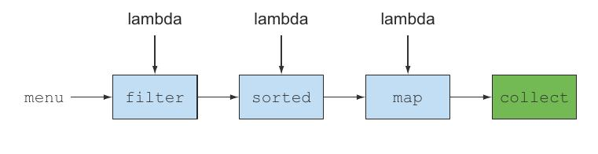
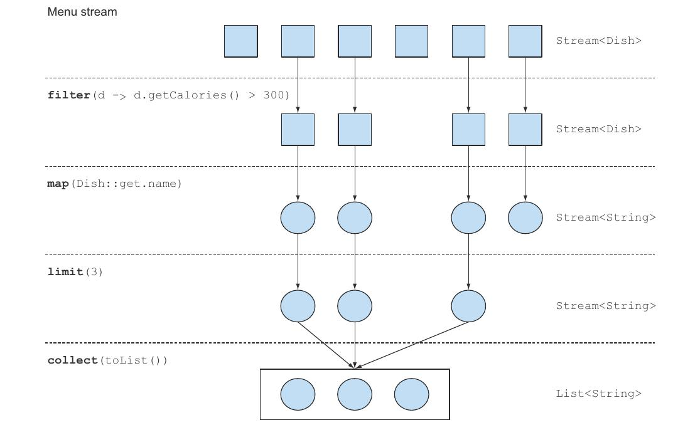
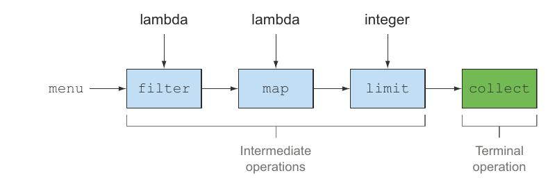

[[chp4]]
== Introducing Streams

Streams are an update to the Java API that lets you manipulate collections of data in a declarative way, you specify
what you want to achieve (that is, filter dishes that are low in calories) as opposed to specifying how to
implement an operation ( using control-flow blocks such as loops and if conditions )

In addition, streams can be processed in parallel transparently, without you having to write any multi-threaded code.
To gain performance you’d need to process Collections in parallel and leverage multi-core architectures.
[source,java]
----
List<Dish> lowCaloricDishes = new ArrayList<>();

for( Dish d: menu ){
    if( d.getCalories() < 400 ){
      lowCaloricDishes.add(d);
    }
}

Collections.sort( lowCaloricDishes,
    new Comparator<Dish>() {
        public int compare( Dish d1, Dish d2 ){
            return Integer.compare( d1.getCalories(), d2.getCalories() );
        }
    }
);

List<String> lowCaloricDishesName = new ArrayList<>();

for( Dish d: lowCaloricDishes ){
    lowCaloricDishesName.add( d.getName() );
}
----

After java8
[source,java]
----
import static java.util.Comparator.comparing;
import static java.util.stream.Collectors.toList;

List<String> lowCaloricDishesName = menu.stream().filter( d -> d.getCalories() < 400 ) <1>
                                        .sorted( comparing(Dish::getCalories) ) <2>
                                        .map( Dish::getname() ) <3>
                                        .collect( toList() ); <4>
----
<1> Select dishes that are below 400 calories.
<2> Sort them by calories.
<3> Extract the names of these dishes.
<4> Store all the names in a List

NOTE: To exploit a multi-core architecture and execute this code in parallel, you need only change stream() to *parallelStream()*:

The code is written in a declarative way: you specify what you want to achieve (that is, filter dishes that are low
in calories) as opposed to specifying how to implement an operation.

You chain together several building-block operations to express a complicated data processing pipeline ) while keeping your
code readable and its intent clear.

NOTE: Because operations such as filter (or sorted, map, and collect) are available as high-level building blocks
that don’t depend on a specific threading model, their internal implementation could be single-threaded or potentially
maximize your multicore architecture transparently! This means you no longer have to worry about threads and locks to
figure out how to parallelize certain data processing tasks: the Streams API does it for you.

To summarize, the Streams API in Java 8 lets you write code that’s :

* Declarative—More concise and readable
* Composable—Greater flexibility
* Parallelizable—Better performance

=== Getting started with Streams

Collections in Java 8 support a new stream method that returns a stream (the interface definition is available in
`java.util.stream.Stream`).

NOTE: You can also get streams in various other ways.

What exactly is a stream? A short definition is *a sequence of elements from a source that supports data processing operations.*

* _Sequence of elements_ Like a collection, a stream provides an interface to a sequenced set of values of a specific element type
* _Source_ Streams consume from a data-providing source such as collections, arrays, or I/O resources.
* _Data processing operations_ Streams support database-like operations and common operations from functional programming
languages to manipulate data, such as filter , map, reduce, find, match, sort, and so on. Stream operations can be executed
either sequentially or in parallel.

In addition, stream operations have two important characteristics:

* _Pipelining_ Many stream operations return a stream themselves, allowing operations to be chained and form a larger
pipeline. This enables certain optimizations such as _laziness_ and _short-circuiting_.
* _Internal iteration_ In contrast to collections, which are iterated explicitly using an iterator, stream operations
do the iteration behind the scenes.

NOTE: Generating a stream from an ordered collection preserves the ordering. The elements of a stream coming from a list will
have the same order as the list.

[source,java]
----
import static java.util.stream.Collectors.toList

List<Dish> menu = Arrays.asList(
    new Dish("pork", false, 800, Dish.Type.MEAT),
    new Dish("beef", false, 700, Dish.Type.MEAT),
    new Dish("french fries", true, 530, Dish.Type.OTHER),
    new Dish("rice", true, 350, Dish.Type.OTHER),
    new Dish("prawns", false, 300, Dish.Type.FISH),
    new Dish("salmon", false, 450, Dish.Type.FISH) );
}

List<String> threeHighCaloricDishNames =
        menu.stream()                           <1>
        .filter( d -> d.getCalories() > 300 )   <2>
        .map(Dish::getName)                     <3>
        .limit(3)                               <4>
        .collect(toList());                     <5>
----
<1> Get a stream from menu, the list of dishes
<2> Create a pipeline of operations: first filter high-calorie dishes
<3> Get the names of dishes
<4> Select only the first three.
<5> Store the results in another List.

All these operations except collect return another stream so they can be connected to form a pipeline, which can be
viewed as a query on the source. +
Finally, the collect operation starts processing the pipeline to return a result.

IMPORTANT: No result is produced, and indeed no element from menu is even selected, until collect is invoked.

You don’t implement the filtering (filter), extracting (map), or truncating (limit) functionalities;
they’re available through the Streams library. As a result, the Streams API has more flexibility to decide how to
optimize this pipeline.

=== Streams vs. collections

In coarsest terms, the difference between collections and streams has to do with when things are computed.

A collection is an in-memory data structure that holds all the values the data structure currently has—every element
in the collection has to be computed before it can be added to the collection. +
(You can add things to, and remove them from, the collection, but at each moment in time, every element in the collection
is stored in memory)

By contrast, a stream is a conceptually fixed data structure (you can’t add or remove elements from it)
whose elements are computed on demand.

The idea is that a user will extract only the values they require from a stream, and these elements are produced
invisibly to the user—only as and when required. This is a form of a producer-consumer relationship.

Another view is that a stream is like a lazily constructed collection: values are computed when they’re solicited by a consumer
In contrast, a collection is eagerly constructed (supplier-driven: fill your warehouse before you start selling)

==== Traversable only once

Similarly to iterators, a stream can be traversed only once. After that a stream is said to be consumed.

IMPORTANT: You can consume a stream only once.

You can get a new stream from the initial data source to traverse it again just like for an iterator.

[source,java]
----
List<String> title = Arrays.asList("Java8", "In", "Action");
Stream<String> s = title.stream();

s.forEach( System.out::println );
s.forEach( System.out::println ); <1>
----
<1> java.lang.IllegalStateException: stream has already been operated upon or closed.

==== External vs. internal iteration

Using the Collection interface requires iteration to be done by the user (for example, using for-each);
this is called _external iteration_.
You iterate a collection externally, explicitly pulling out and processing the items one by one.
[source,java]
----
List<String> names = new ArrayList<>();
for( Dish d: menu ){
    names.add( d.getName() );
}
----

The Streams library by contrast uses _internal iteration_ it does the iteration for you and takes care of storing the
resulting stream value somewhere; you merely provide a function saying what’s to be done.

[source,java]
----
import static java.util.stream.Collectors.toList;

List<String> names = menu.stream()
                .map( Dish::getName)
                .collect( toList() );
----

NOTE: Using an internal iteration, the processing of items could be transparently done in parallel or in a different order
that may be more optimized. The internal iteration in the Streams library can automatically choose a data representation
and implementation of parallelism to match your hardware. By contrast, once you’ve chosen external iteration by writing
for-each, then you’ve essentially committed to self-manage any parallelism.

This is useful only if you have a list of predefined operations to work with (for example, filter or map) that hide
the iteration. Most of these operations take lambda expressions as arguments so you can parameterize their behavior.
The Java language shipped the Streams API with an extensive list of operations you can use to express complicated data
processing queries.

==== Stream operations

The `Stream` interface in `java.util.stream.Stream` defines many operations.

They can be classified into two categories:

* `filter`, `map`, and `limit` can be connected together to form a pipeline.
* `collect` causes the pipeline to be executed and closes it.

Stream operations that can be connected are called _intermediate operations_, and operations that close a stream
are called _terminal operations_.

.Intermediate operations

Intermediate operations such as filter or sorted return another stream as the return type.
This allows the operations to be connected to form a query.

IMPORTANT: Intermediate operations don’t perform any processing until a terminal operation is invoked on
the stream pipeline, they’re lazy. This is because intermediate operations can usually be merged and processed into
a single pass by the terminal operation.

[source,java]
----
List<String> names =
        menu.stream()
            .filter( d -> {
                System.out.println("filtering" + d.getName());
                return d.getCalories() > 300;
            })
            .map( d -> {
                  System.out.println("mapping" + d.getName());
                  return d.getName();
            })
            .limit(3)
            .collext( toList() );
----

The output is:

filtering pork +
mapping pork +
filtering beef +
mapping beef +
filtering chicken +
mapping chicken +
_[pork, beef, chicken]_

You can notice several optimizations due to the lazy nature of streams.
Despite the fact that many dishes have more than 300 calories, only the first three are selected, this
is because of the limit operation and a technique called *short-circuiting*. +
Despite the fact that filter and map are two separate operations, they were merged into the same pass, we call
this technique *loop fusion*.

.Terminal operations

Terminal operations produce a result from a stream pipeline.

A result is any non-stream value such as a `List`, an `Integer`, or even `void`.

[source,java]
----
menu.stream().forEach(System.out::println); <1>
----
<1> `forEach` is a terminal operation that returns void and applies a lambda to each dish in the source.

==== Working with streams

To summarize, working with streams in general involves three items:

* A data source (such as a collection) to perform a query on
* A chain of intermediate operations that form a stream pipeline
* A terminal operation that executes the stream pipeline and produces a result

The idea behind a stream pipeline is similar to the *builder pattern*.

.Table Intermediate operations
|===
| Operation | Return type | Argument of the operation |Function descriptor

| filter
| Stream<T>
| Predicate<T>
| T -> boolean

| map
| Stream<R>
| Function<T, R>
| T -> R

| limit
| Stream<T>

| sorted
| Stream<T>
| Comparator<T>
| (T, T) -> int

| distinct
| Stream<T>
|===

.Table Terminal operations
|===
| Operation | Purpose

| forEach
| Consumes each element from a stream and applies a lambda to each of them. The operation returns void.

| count
| Returns the number of elements in a stream. The operation returns a long.

| collect
| Reduces the stream to create a collection such as a List, a Map, or even an Integer.
|===

<<Chp3.adoc#Lambda, <= Chapter 3 >>  <<Chp5.adoc#chp5,  Chapter 5 => >>
