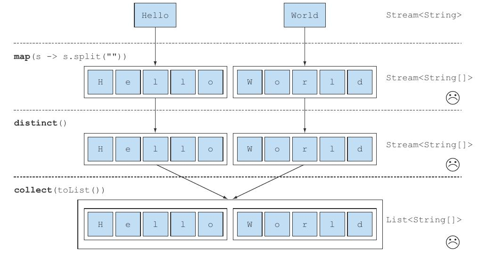
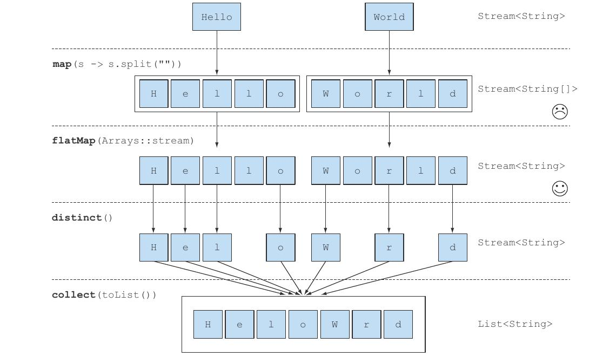
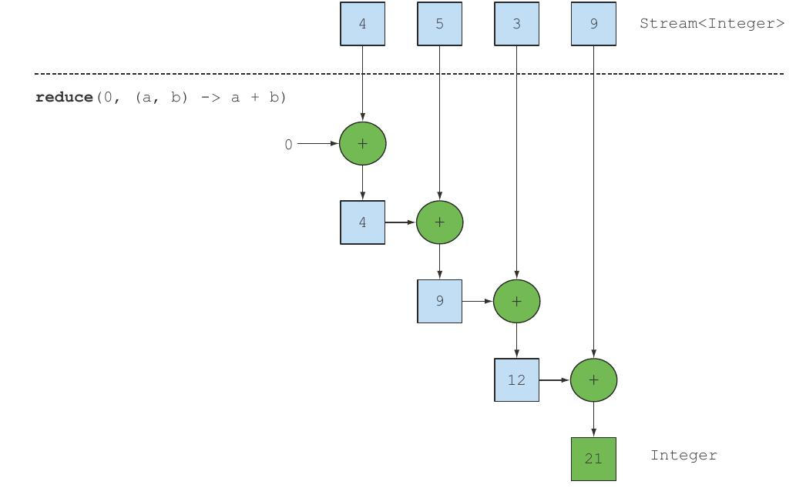
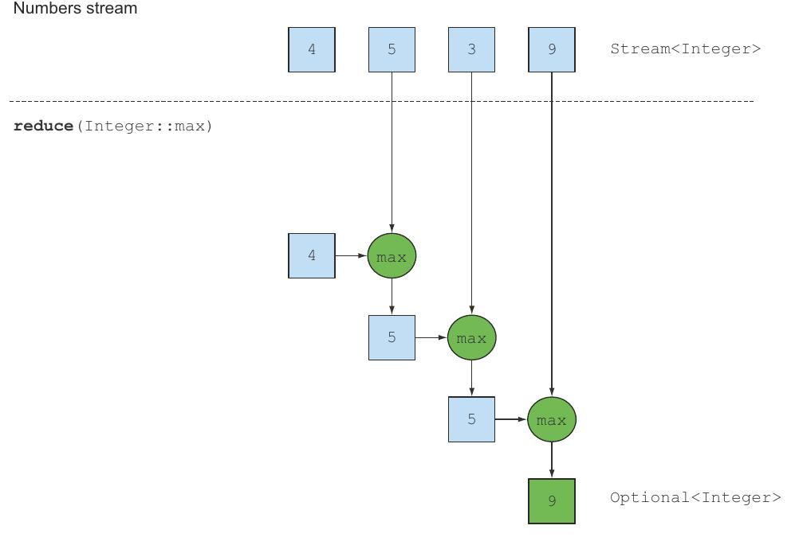

[[chp5]]
== Working with streams

Streams let you move from external iteration to internal iteration.

You can use the Streams API, which supports the `filter` and `collect` operations, to manage the iteration over
the collection of data for you. All you need to do is pass the filtering behavior as argument to the filter method:

This different way of working with data is useful because you let the Streams API manage how to process the data. +
As a consequence, the Streams API can work out several optimizations behind the scenes. +
In addition, using internal iteration, the Streams API can decide to run your code in parallel.

=== Filtering and slicing

==== Filtering with a predicate

The Streams interface supports a `filter` method. This operation takes as argument a `Predicate` (a function returning a boolean)
and returns a stream including all elements that match the predicate.
[source,java]
----
List<Dish> vegetarianMenu = menu.stream()
    .filter( Dish::isVegetarian )
    .collect( toList() );
----

==== Filtering unique elements

Streams also support a method called `distinct` that returns a stream with unique elements, according to the implementation
of the `hashCode` and `equals` methods of the objects produced by the stream
[source,java]
----
List<Integer> numbers = Arrays.asList(1, 2, 1, 3, 3, 2, 4);

    numbers.stream()
        .filter( id -> id % 2 == 0 )
        .distinct()
        .forEach( System.out::println );

----

==== Truncating a stream

Streams support the `limit(n)` method, which returns another stream that’s no longer than a given size.
The requested size is passed as argument to limit.

[source,java]
----
List<Dish> dishes = menu.stream()
    .filter(    d -> d.getCalories() > 300  )
    .limit( 3 )
    .collect( toList() );
----

==== Skipping elements

Streams support the `skip(n)` method to return a stream that discards the first n elements.
If the stream has fewer elements than n, then an empty stream is returned.

[source,java]
----
List<Dish> dishes = menu.stream()
    .filter( d -> d.getCalories() > 300 )
    .skip( 2 )
    .collect( toList() );
----

=== Mapping

A very common data processing idiom is to select information from certain objects.
For example, in SQL you can select a particular column from a table.

The Streams API provides similar facilities through the `map` and `flatMap` methods.

==== Applying a function to each element of a stream

*The function is applied to each element, mapping it into a new element*, the word mapping is used because it
has a meaning similar to transforming but with the nuance of “creating a new version of” rather than “modifying”.

[source,java]
----
List<String> dishNames = menu.stream()
    .map( Dish::getName ) <1>
    .collect( toList() );
----
<1> The method reference `Dish::getName` is passed to the `map` method to extract the names of the dishes in the stream.

NOTE: Because the method `getName` returns a `String`, the stream outputted by the `map` method is of type `Stream<String>`.

[source,java]
----
List<String> words = Arrays.asList( "Java8", "Lambdas", "In", "Action" );

List<Integer> wordLengths = words.stream()
    .map( String::length )
    .collect( toList() );
----

What if you wanted to find out the length of the name of each dish? You could do this by chaining another `map` as follows:

[source,java]
----
List<Integer> dishNameLengths = menu.stream()
    .map( Dish::getName )
    .map( String::length )
    .collect( toList() );
----

==== Flattening streams

How could you return a list of all the unique characters for a list of words? For example, given the list of words
["Hello", "World"] you’d like to return the list ["H", "e", "l", "o", "W", "r", "d"].

[source,java]
----
words.stream()
    .map( word -> word.split("") )
    .distinct()
    .collect( toList() );
----

The problem with this approach is that the lambda passed to the map method returns a `String[]` (an array of String)
for each word. So the stream returned by the map method is actually of type `Stream<String[]>`.
What you really want is `Stream<String>` to represent a stream of characters

You need a stream of characters instead of a stream of arrays. There’s a method called `Arrays.stream()` that takes
an array and produces a stream.
[source,java]
----
String[] arrayOfWords = {"Goodbye", "World"};

Stream<String> streamOfwords = Arrays.stream( arrayOfWords );
----

[source,java]
----
words.stream()
    .map( word -> word.split( "" ) )
    .map( Arrays::stream )
    .distinct()
    .collect( toList() );
----

The current solution still doesn’t work, because you now end up with a list of streams, more precisely,
`Stream<Stream<String>>`

You can fix this problem by using `flatMap`.

[source,java]
----
List<String> uniqueCharacters =
    words.stream()
        .map(w -> w.split( "" ))
        .flatMap(Arrays::stream )
        .distinct()
        .collect( Collectors.toList() );
----

Using the `flatMap` method has the effect of mapping each array not with a stream but with the contents of that stream.
All the separate streams that were generated when using `map(Arrays::stream)` get amalgamated—flattened into a single stream.

In a nutshell, the `flatMap` method lets you replace each value of a stream with another stream and then concatenates
all the generated streams into a single stream.

Given [1, 2, 3, 4, 5] you should return [1, 4, 9, 16, 25].

[source,java]
----
List<Integer> numbers = Arrays.asList(1, 2, 3, 4, 5);

List<Integer> squares =
    numbers.stream()
        .map( n -> n * n )
        .collect(toList());
----

Given a list [1, 2, 3] and a list [3, 4] you should return [(1, 3), (1, 4), (2, 3), (2, 4), (3,3), (3, 4)].

[source,java]
----
List<Integer> numbers1 = Arrays.asList(1, 2, 3);
List<Integer> numbers2 = Arrays.asList(3, 4);

List<int[]> pairs =
    numbers1.stream()
        .flatMap( id -> numbers2.stream().map( j -> new int[]{id, j} ) )
        .collect(toList());
----

Extend the previous example to return only pairs whose sum is divisible by 3
[source,java]
----
List<Integer> numbers1 = Arrays.asList(1, 2, 3);
List<Integer> numbers2 = Arrays.asList(3, 4);

List<int[]> pairs =
    numbers1.stream()
        .flatMap( id -> numbers2.stream().filter( j -> (id + j) % 3 == 0 ).map( j -> new int[]{id, j} ))
        .collect(toList());
----

=== Finding and matching

Another common data processing idiom is finding whether some elements in a set of data match a given property.
The Streams API provides such facilities through the `allMatch`, `anyMatch`, `noneMatch`, `findFirst`, and `findAny`
methods of a stream.

==== Checking to see if a predicate matches at least one element

The `anyMatch` method can be used to answer the question _“Is there an element in the stream matching the given
predicate?”_ +
For example, can be used to find out whether the menu has a vegetarian option:
[source,java]
----
if( menu.stream().anyMatch( Dish::isVegetarian ) ){
    System.out.println( "The menu is (somewhat) vegetarian friendly!!" );
}
----

The `anyMatch` method returns a boolean and is therefore a _terminal operation_.

==== Checking to see if a predicate matches all elements

The `allMatch` method works similarly to `anyMatch` but will check to see if all the elements of the stream match
the given predicate. For example, you can use it to find out whether the menu is healthy
(that is, all dishes are below 1000 calories):
[source,java]
----
boolean isHealthy = menu.stream()
    .allMatch( d -> d.getCalories() < 1000 );
----

The opposite of `allMatch` is `noneMatch`. It ensures that no elements in the stream match the given predicate. +
For example, you could rewrite the previous example as follows using noneMatch:
[source,java]
----
boolean isHealthy = menu.stream()
    .noneMatch( d -> d.getCalories() >= 1000 );
----
These three operations, anyMatch , allMatch, and noneMatch, make use of what we call *short-circuiting*,
a stream version of the familiar Java short-circuiting `&&` and `||` operators.

NOTE: In relation to streams, certain operations such as `allMatch`, `noneMatch`, `findFirst`, and `findAny` don’t need
to process the whole stream to produce a result. As soon as an element is found, a result can be produced. +
Similarly, `limit` is also a short-circuiting operation: the operation only needs to create a stream of a given size
without processing all the elements in the stream.

==== Finding an element

The `findAny` method returns an arbitrary element of the current stream. It can be used in conjunction with other stream
operations. +
For example, you may wish to find a dish that’s vegetarian. You can combine the `filter` method and `findAny`
to express this query:
[source,java]
----
Optional<Dish> dish = menu.stream()
        .filter( Dish::isVegetarian )
        .findAny();
----

NOTE: It’s possible that `findAny` doesn’t find any element. Instead of returning null, which is well known for being error
prone, the Java 8 library designers introduced `Optional<T>`

===== Finding the first element

Some streams have an _encounter order_ that specifies the order in which items logically appear in the stream
(for example, a stream generated from a List or from a sorted sequence of data).
For such streams you may wish to find the first element. +
There’s the `findFirst` method for this.
[source,java]
----
List<Integer> someNumbers = Arrays.asList(1, 2, 3, 4, 5);
Optional<Integer> firstSquareDivisibleByThree =
        someNumbers.stream()
            .map( x -> x * x )
            .filter( x -> x % 3 == 0 )
            .findFirst(); // 9
----

NOTE: When to use `findFirst` and `findAny`, the answer is parallelism. Finding the first element is more constraining
in parallel. If you don’t care about which element is returned, use `findAny` because it’s less constraining when using
parallel streams.

=== Reducing

So far, the terminal operations you’ve seen return a `boolean` (`allMatch `and so on), `void` (`forEach`), or an `Optional`
object (`findAny` and so on).

You’ve also been using `collect` to combine all elements in a stream into a List.

In this section, you’ll see how you can combine elements of a stream to express more complicated queries such as
“Calculate the sum of all calories in the menu,” or “What is the highest calorie dish in the menu?” using the `reduce`
operation.

Such queries combine all the elements in the stream repeatedly to produce a single value such as an Integer .
These queries can be classified as _reduction operations_ (a stream is reduced to a value).

In functional programming-language jargon, this is referred to as a _fold_ because you can view this operation as
repeatedly folding a long piece of paper (your stream) until it forms a small square, which is the result of the fold operation.

==== Summing the elements

[source,java]
----
int sum = 0;
for (int x : numbers) {
    sum += x;
}
----
Each element of numbers is combined iteratively with the addition operator to form a result.
You reduce the list of numbers into one number by repeatedly using addition.

You can sum all the elements of a stream as follows:
`int sum = numbers.stream().reduce( 0, (a, b) -> a + b );`

the `reduce` takes two arguments:

* An initial value, here 0.
* A `BinaryOperator<T>` to combine two elements and produce a new value; here you use the lambda `(a, b) -> a + b`.

You could just as easily multiply all the elements by passing a different lambda, `(a, b) -> a * b`, to the reduce operation:
`int product = numbers.stream().reduce( 1, (a, b) -> a * b )`;

First, 0 is used as the first parameter of the lambda (a), and 4 is consumed from the stream and used as
the second parameter (b). 0 + 4 produces 4, and it becomes the new accumulated value. +
Then the lambda is called again with the accumulated value and the next element of the stream, 5, which produces the
new accumulated value, 9. +
Moving forward, the lambda is called again with the accumulated value and the next element, 3, which produces 12. +
Finally, the lambda is called with 12 and the last element of the stream, 9 , which produces the final value, 21.

You can make this code more concise by using a method reference. +
`int sum = numbers.stream().reduce( 0, Integer::sum );`

There’s also an overloaded variant of reduce that doesn’t take an initial value, but it returns an Optional object:
`Optional<Integer> sum = numbers.stream().reduce( (a, b) -> (a + b) );`

The reduce operation can’t return a sum because it doesn’t have an initial value. This is why the result is wrapped in
an Optional object to indicate that the sum may be absent.

==== Maximum and minimum

As you saw, reduce takes two parameters:

* An initial value
* A lambda to combine two stream elements and produce a new value

The lambda is applied step by step to each element of the stream with the addition operator.
The reduce operation will use the new value with the next element of the stream to produce a new maximum until
the whole stream is consumed.

`Optional<Integer> max = numbers.stream().reduce(Integer::max);`

To calculate the minimum, you need to pass Integer.min to the reduce operation instead of Integer.max:

`Optional<Integer> min = numbers.stream().reduce(Integer::min);`

NOTE: You could have equally well used the lambda `(x,y)-> x<y ? x:y` instead of `Integer::min`.

How would you count the number of dishes in a stream using the map and reduce methods?
[source,java]
----
int count = menu.stream()
    .map(d -> 1)
    .reduce( 0, (a, b) -> a + b );
----

NOTE: The benefit of using reduce compared to the step-by-step iteration summation that you wrote earlier is that
the iteration is abstracted using internal iteration, which enables the internal implementation to choose to
perform the reduce operation in parallel.

==== Stream operations: stateless vs. stateful

You’ve seen a lot of stream operations. An initial presentation can make them seem a panacea; everything just works,
and you get parallelism for free when you use `parallelStream` instead of `stream` to get a stream from a collection.

Operations like `map` and `filter` take each element from the input stream and produce zero or one result in the
output stream. These operations are thus in general stateless: they don’t have an internal state (assuming the user-supplied lambda or
method reference has no internal mutable state).

But operations like reduce, sum, and max need to have internal state to accumulate the result.

By contrast, some operations such as `sorted` or `distinct` seem at first to behave
like filter or map—all take a stream and produce another stream (an intermediate operation), but there’s a crucial
difference. Both sorting and removing duplicates from a stream require knowing the previous history to do their job.
For example, sorting requires all the elements to be buffered before a single item can be added to the output stream;
the storage requirement of the operation is unbounded.
This can be problematic if the data stream is large or infinite. We call these operations stateful operations.

.Table Intermediate and terminal operations
|===
|Operation | Type | Return type | Type/functional interface used | Function descriptor

| filter
¹ Intermediate
| Stream<T>
| Predicate<T>
| T -> boolean

| distinct
| Intermediate (stateful-unbounded)
| Stream<T>
|
|

| skip
| Intermediate (stateful-bounded)
| Stream<T>
| long
|

| limit
| Intermediate (stateful-bounded)
| Stream<T>
| long
|

| map
| Intermediate
| Stream<R>
| Function<T, R>
| T -> R

| flatMap
| Intermediate
| Stream<R>
| Function<T,Stream<R>>
| T -> Stream<R>

| sorted
| Intermediate (stateful-unbounded)
| Stream<T>
| Comparator<T>
| (T, T) -> int

| anyMatch
| Terminal
| boolean
| Predicate<T>
| T -> boolean

| noneMatch
| Terminal
| boolean
| Predicate<T>
| T -> boolean

| allMatch
| Terminal
| boolean
| Predicate<T>
| T -> boolean

| findAny
| Terminal
| Optional<T>
|
|

| findFirst
| Terminal
| Optional<T>
|
|

| forEach
| Terminal
| void
| Consumer<T>
| T -> void

| collect
| terminal
| R
| Collector<T, A, R>
|

|reduce
| Terminal (stateful-bounded)
| Optional<T>
| BinaryOperator<T>
| (T, T) -> T

| count
| Terminal
| long
|
|

|===

=== Putting it all into practice

Find all transactions in the year 2011 and sort them by value (small to high).
[source,java]
----
transactionList.stream()
	.filter( t -> t.getYear() == 2011 )
	.sorted( (t1, t2) -> ((Integer) t1.getValue()).compareTo( t2.getValue() ) )
	.collect( toList() );
----

What are all the unique cities where the traders work?
[source,java]
----
transactionList.stream()
	.map( t -> t.getTrader().getCity() )
	.distinct()
	.collect( toList() );
----

Find all traders from Cambridge and sort them by name.
[source,java]
----
transactionList.stream()
	.filter( t -> t.getTrader().getCity().equals( "Cambridge" ) )
	.map( t -> t.getTrader() )
	.distinct()
	.sorted( (t1, t2) -> t1.getName().compareTo( t2.getName() ) )
	.collect( toList() );
----

Return a string of all traders’ names sorted alphabetically.
[source,java]
----
final String names = transactionList.stream()
	.map( t -> t.getTrader().getName() )
	.distinct()
	.sorted()
	.reduce( "", (a,b) ->  a + b );
----

Are any traders based in Milan?
[source,java]
----
final boolean isAnyFromMilan = transactionList.stream()
	    .anyMatch( t -> t.getTrader().getCity().equals( "Milan" ) );
----

Print all transactions’ values from the traders living in Cambridge.
[source,java]
----
transactionList.stream()
    .filter( t -> t.getTrader().getCity().equals( "Cambridge" ) )
	.map(Transaction::getValue)
	.forEach( v -> System.out.println(v) );
----

A stream supports the methods `min` and `max` that take a `Comparator` as argument to specify which key to compare
with when calculating the minimum or maximum:
[source,java]
----
Optional<Transaction> smallestTransaction =
        transactions.stream()
        .min( comparing(T ransaction::getValue ) );
----

=== Numeric streams

You could use the reduce method to calculate the sum of the elements of a stream.
For example, you can calculate the number of calories in the menu:
[source,java]
----
int calories = menu.stream()
         .map( Dish::getCalories )
        .reduce( 0, Integer::sum );
----

The problem with this code is that there’s an insidious boxing cost. Behind the scenes each Integer needs to be
unboxed to a primitive before performing the summation.

The Streams API also supplies primitive stream specializations that support specialized methods to
work with streams of numbers.

==== Primitive stream specializations

Java 8 introduces three primitive specialized stream interfaces to tackle this issue, `IntStream`, `DoubleStream`, and
`LongStream`, that respectively specialize the elements of a stream to be `int`, `long`, and `double` and thereby
avoid hidden boxing costs.

Each of these interfaces brings new methods to perform common numeric reductions such as `sum` to calculate the sum of
a numeric stream and `max` to find the maximum element. In addition, they have methods to convert back to a stream of
objects when necessary.

.Mapping to a numeric stream

The most common methods you’ll use to convert a stream to a specialized version are `mapToInt`, `mapToDouble`, and
`mapToLong`.

These methods work exactly like the method map that you saw earlier but return a specialized stream instead of a
`Stream<T>`.
[source,java]
----
int calories = menu.stream()
        .mapToInt(Dish::getCalories) <1>
        .sum();
----
<1> The method `mapToInt` extracts all the calories from each dish and returns an `IntStream` as the result
(rather than a `Stream<Integer>`).

IntStream` also supports other convenience methods such as `max`, `min`, and `average`.

.Converting back to a Stream of Objects

Once you have a numeric stream, you may be interested in converting it back to a nonspecialized stream.

The operations of an `IntStream` are restricted to produce primitive integers: the map operation of an `IntStream` takes a
lambda that takes an `int` and produces an `int` (an `IntUnaryOperator`).

But you may want to produce a different value such as a Dish.

For this you need to access the operations defined in the `Streams` interface that are more general. To convert from a
primitive stream to a general stream (each int will be boxed to an Integer) you can use the method `boxed` as follows:
[source,java]
----
IntStream intStream = menu.stream().mapToInt(Dish::getCalories); <1>
Stream<Integer> stream = intStream.boxed(); <2>
----
<1> Converting a `Stream` to a numeric stream
<2> Converting the numeric stream to `Stream`

.Default values: OptionalInt

`Optional` class, is a container that indicates the presence or absence of a value.

`Optional` can be parameterized with reference types such as `Integer`, `String`, and so on.

There’s a primitive specialized version of Optional as well for the three primitive stream specializations:
`OptionalInt`, `OptionalDouble`, and `OptionalLong`
[source,java]
----
OptionalInt maxCalories = menu.stream()
    .mapToInt( Dish::getCalories )
    .max();
----

You can now process the OptionalInt explicitly to define a default value if there’s no maximum:
[source,java]
----
int max = maxCalories.orElse( 1 );
----

==== Numeric ranges

A common use case when dealing with numbers is working with ranges of numeric values.

Suppose you’d like to generate all numbers between 1 and 100. Java 8 introduces two static methods available on
`IntStream` and `LongStream` to help generate such ranges: `range` and `rangeClosed`.
[source,java]
----
IntStream evenNumbers = IntStream.rangeClosed(1, 100)
    .filter(n -> n % 2 == 0);

System.out.println(evenNumbers.count());
----

Here you use the rangeClosed method to generate a range of all numbers from 1 to 100. +
It produces a stream so you can chain the filter method to select only even numbers.

At this stage no computation has been done. Finally, you call count on the resulting stream. +
Because count is a terminal operation, it will process the stream and return the result 50, which is the number of
even numbers from 1 to 100, inclusive.
NOTE: If you were using `IntStream.range(1, 100)` instead, the result would be 49 even numbers because range is exclusive.

==== Putting numerical streams into practice: Pythagorean triples

Pythagorean Theorem

All the triples of numbers (a, b, c) satisfy the formula a * a + b * b = c * c where a, b, and c are integers

[source,java]
----
Stream<int[]> pythagoreanTriples =
    IntStream.rangeClosed( 1, 100 )
        .boxed() <1>
        .flatMap( a -> <2>
            IntStream.rangeClosed( a, 100 )
            .filter( b -> Math.sqrt(a*a + b*b) % 1 == 0 )
            .mapToObj( b -> new int[]{ a, b, (int)Math.sqrt(a * a + b * b) } )
        );

pythagoreanTriples.limit( 5 )
    .forEach(t -> System.out.println( t[0] + ", " + t[1] + ", " + t[2] ) );
----
<1> `boxed()` is necessary because rangeClosed the result of following operations would be a `int` and not as we want a
`int[]`.
<2> Mapping a value of `a` to a stream of triples would result in a stream of streams! The `flatMap` method does the
mapping and also flattens all the generated streams of triples into a single stream.
As a result you produce a stream of triples.

A better solution
[source,java]
----
Stream<double[]> pythagoreanTriples2 =
 IntStream.rangeClosed( 1, 100 ).boxed()
        .flatMap( a ->
            IntStream.rangeClosed( a, 100 )
            .mapToObj( b -> new double[]{ a, b, Math.sqrt( a*a + b*b ) } )
            .filter( t -> t[2] % 1 == 0 )
        );
----

=== Building streams

You can create a stream from a sequence of values, from an array, from a file, and even from a generative function
to create infinite streams!

==== Streams from values

You can create a stream with explicit values by using the static method `Stream.of`, which can take any number of parameters.
[source,java]
----
Stream<String> stream = Stream.of( "Java 8 ", "Lambdas ", "In ", "Action" );

stream.map( String::toUpperCase ).forEach( System.out::println );
----

You can get an empty stream using the empty method as follows:
`Stream<String> emptyStream = Stream.empty();`

==== Streams from arrays

You can create a stream from an array using the static method `Arrays.stream`, which takes an array as parameter.
[source,java]
----
int[] numbers = { 2, 3, 5, 7, 11, 13 };

int sum = Arrays.stream( numbers ).sum();
----

==== Streams from files

Java’s NIO API (non-blocking I/O ).
Many static methods in java.nio.file.Files return a stream.

You use `Files.lines` to return a stream where each element is a line in the given file.

[source,java]
----
long uniqueWords = 0;

try( Stream<String> lines = Files.lines( Paths.get("data.txt"), Charset.defaultCharset() ) ){ <1>
    uniqueWords = lines.flatMap( line -> Arrays.stream( line.split(" ") ) )
                        .distinct()
                        .count();
}
catch( IOException e ){
    //...
}
----
<1> Streams are autoclosable

==== Streams from functions: creating infinite streams!

The Streams API provides two static methods to generate a stream from a function: `Stream.iterate` and `Stream.generate`.

These two operations let you create what we call an *infinite stream*: a stream that doesn’t have a fixed size like when
you create a stream from a fixed collection.

Streams produced by iterate and generate create values on demand given a function and can therefore calculate values
forever! It’s generally sensible to use `limit(n)` on such streams to avoid printing an infinite number of values.

.Iterate

[source,java]
----
Stream.iterate( 0, n -> n + 2 )
    .limit(10)
    .forEach( System.out::println );
----

The `iterate` method takes an initial value, here 0, and a lambda (of type `UnaryOperator<T>`) to apply successively
on each new value produced.

This iterate operation is fundamentally sequential because the result depends on the previous application.

NOTE: This operation produces an infinite stream, the stream doesn’t have an end because values are computed
on demand and can be computed forever. We say the stream is _unbounded_.

Fibonacci
[source,java]
----
Stream.iterate( new int[]{0, 1}, t -> new int[]{ t[1],t[0] + t[1] } )
    .limit( 10 )
    .map( t -> t[0] )
    .forEach( System.out::println );
----

.Generate

Similarly to the method iterate, the method generate lets you produce an infinite stream of values computed on demand.
But generate doesn’t apply successively a function on each new produced value. It takes a lambda of type `Supplier<T>`
to provide new values.
[source,java]
----
Stream.generate( Math::random )
    .limit( 5 )
    .forEach( System.out::println );
----

Fibonacci
[source,java]
----
IntSupplier fib = new IntSupplier(){
    private int previous = 0;
    private int current = 1;

    public int getAsInt(){
        int oldPrevious = this.previous;
        int nextValue = this.previous + this.current;
        this.previous = this.current;
        this.current = nextValue;
        return oldPrevious;
    }
};

IntStream.generate( fib ).limit( 10 ).forEach( System.out::println );
----
<<Chp4.adoc#chp4, <= Chapter 4 >>  <<Chp6.adoc#chp6,  Chapter 6 => >>
